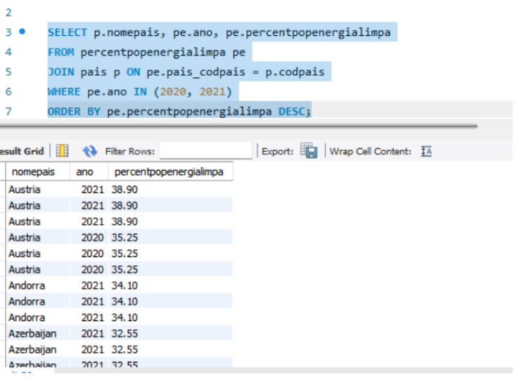
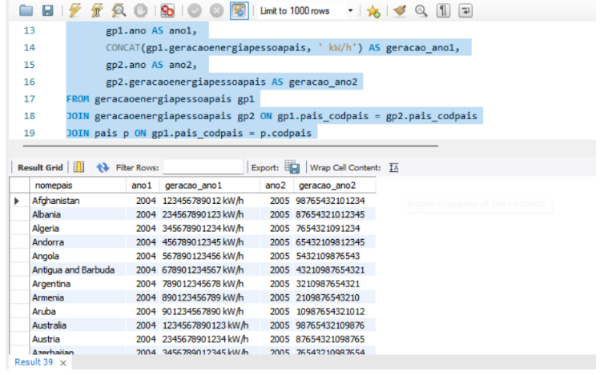
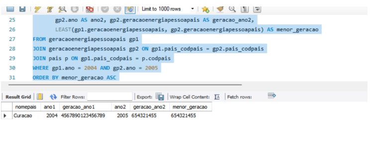
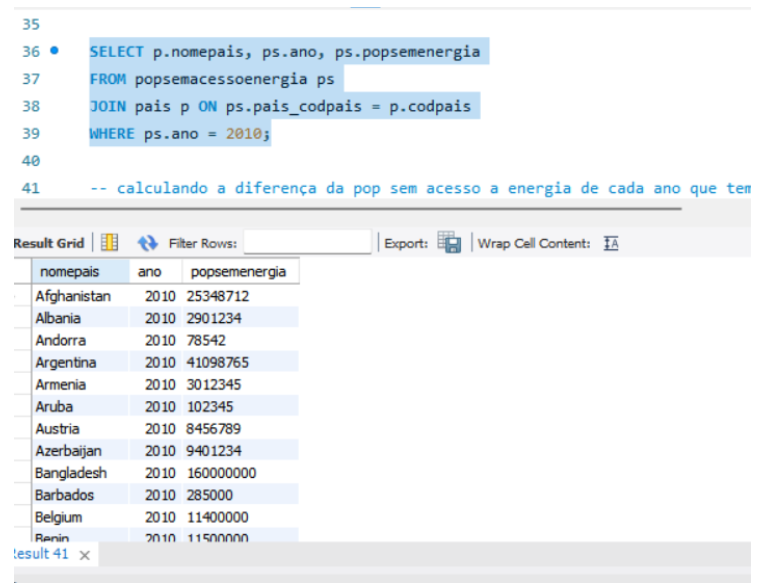
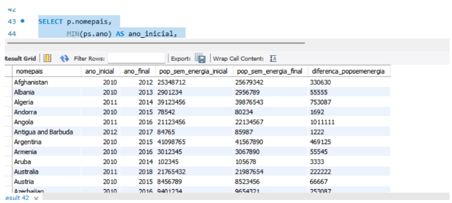
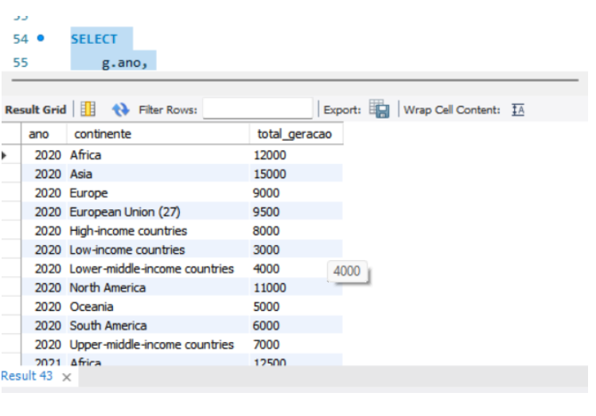

# Consultas SQL a Base de Dados 

### Consulta 1

```sql
SELECT p.nomepais, pe.ano, pe.percentpopenergialimpa
FROM percentpopenergialimpa pe
JOIN pais p ON pe.pais_codpais = p.codpais
WHERE pe.ano IN (2020, 2021)
ORDER BY pe.percentpopenergialimpa DESC;
```

- **Comentário**: 
    - Esta consulta retorna o nome do país, o ano e o percentual da população utilizando energia limpa (clean cooking fuels) nos anos de 2020 e 2021.
    - Utiliza um `JOIN` para buscar o nome dos países a partir de seus códigos na tabela `pais`.
    - O `WHERE` filtra os dados apenas para os anos de 2020 e 2021.
    - O `ORDER BY` ordena os resultados de forma decrescente (`DESC`), exibindo os países com maiores percentuais de uso de energia limpa primeiro.

---

### Consulta 2

```sql
SELECT p.nomepais, 
       gp1.ano AS ano1, 
       CONCAT(gp1.geracaoenergiapessoapais, ' kW/h') AS geracao_ano1, 
       gp2.ano AS ano2, 
       gp2.geracaoenergiapessoapais AS geracao_ano2
FROM geracaoenergiapessoapais gp1
JOIN geracaoenergiapessoapais gp2 ON gp1.pais_codpais = gp2.pais_codpais
JOIN pais p ON gp1.pais_codpais = p.codpais
WHERE gp1.ano = 2004 AND gp2.ano = 2005;
```

- **Comentário**:
    - Esta consulta faz uma comparação entre a geração de energia por pessoa para cada país nos anos de 2004 e 2005.
    - A função `CONCAT` adiciona a unidade ' kW/h' à geração de energia, para tornar a informação mais clara.
    - A consulta utiliza `JOIN` para garantir que os dados sejam comparados para o mesmo país em ambos os anos.
    - O resultado exibirá a geração de energia de cada país nos anos de 2004 e 2005.

---

### Consulta 3

```sql
SELECT p.nomepais, gp1.ano AS ano1, gp1.geracaoenergiapessoapais AS geracao_ano1, 
       gp2.ano AS ano2, gp2.geracaoenergiapessoapais AS geracao_ano2,
       LEAST(gp1.geracaoenergiapessoapais, gp2.geracaoenergiapessoapais) AS menor_geracao
FROM geracaoenergiapessoapais gp1
JOIN geracaoenergiapessoapais gp2 ON gp1.pais_codpais = gp2.pais_codpais
JOIN pais p ON gp1.pais_codpais = p.codpais
WHERE gp1.ano = 2004 AND gp2.ano = 2005
ORDER BY menor_geracao ASC
LIMIT 1;
```

- **Comentário**:
    - Esta consulta busca verificar qual país teve a menor geração de energia entre os anos de 2004 e 2005.
    - A função `LEAST()` retorna o menor valor de geração entre os dois anos para cada país.
    - O `ORDER BY` ordena os resultados do menor para o maior valor de geração, e o `LIMIT 1` garante que apenas o país com a menor geração seja retornado.

---

### Consulta 4

```sql
SELECT p.nomepais, ps.ano, ps.popsemenergia
FROM popsemacessoenergia ps
JOIN pais p ON ps.pais_codpais = p.codpais
WHERE ps.ano = 2010;
```

- **Comentário**:
    - Esta consulta retorna os países e a quantidade de população sem acesso à energia no ano de 2010.
    - Utiliza um `JOIN` para buscar o nome dos países e o `WHERE` filtra os dados para o ano específico de 2010.
    - O resultado mostrará a população sem acesso à energia para cada país naquele ano.

---

### Consulta 5

```sql
SELECT p.nomepais, 
       MIN(ps.ano) AS ano_inicial, 
       MAX(ps.ano) AS ano_final, 
       MIN(ps.popsemenergia) AS pop_sem_energia_inicial, 
       MAX(ps.popsemenergia) AS pop_sem_energia_final, 
       (MAX(ps.popsemenergia) - MIN(ps.popsemenergia)) AS diferenca_popsemenergia
FROM popsemacessoenergia ps
JOIN pais p ON ps.pais_codpais = p.codpais
GROUP BY p.nomepais
ORDER BY p.nomepais;
```

- **Comentário**:
    - Esta consulta calcula a diferença no número de pessoas sem acesso à energia entre os anos inicial e final para cada país.
    - Usa `MIN()` para encontrar o primeiro ano e `MAX()` para encontrar o ano mais recente.
    - A diferença no número de pessoas sem energia é calculada usando `(MAX() - MIN())`.
    - A consulta agrupa os resultados por país usando o `GROUP BY` e os ordena alfabeticamente com `ORDER BY`.

---

### Consulta 6

```sql
SELECT 
    g.ano,
    c.nomecontinente AS continente,
    SUM(g.geracaoenergiacontinente) AS total_geracao
FROM 
    geracaoenergiacontinente g
JOIN 
    continente c ON g.continente_codcontinente = c.codcontinente
GROUP BY 
    g.ano, c.nomecontinente
ORDER BY 
    g.ano, c.nomecontinente;
```

- **Comentário**:
    - Esta consulta calcula a geração total de energia por continente para cada ano.
    - Utiliza a função `SUM()` para somar a geração de energia de todos os países dentro de cada continente.
    - O `GROUP BY` agrupa os resultados por ano e continente, enquanto o `ORDER BY` ordena os resultados por ano e continente.