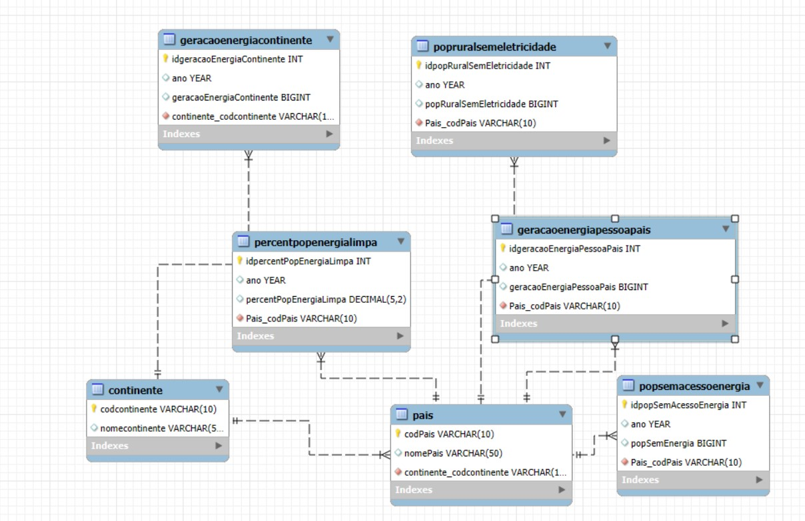

<h1 align = "center">
  Consumo Global de Energia 
</h1>
 
### INTRODUÇÃO

Nas últimas décadas, o consumo global de energia tem experimentado uma transformação acelerada, impulsionada pela industrialização, urbanização e crescimento populacional. Essas mudanças trazem consigo desafios complexos, como a crise climática e a desigualdade no acesso à energia.
  
Este relatório analisa as tendências do consumo global de energia no período de 1990 até 2021, com foco nas disparidades entre países desenvolvidos e em desenvolvimento. Nosso objetivo é fornecer uma visão clara sobre o consumo de energia mundial e o seu impacto.  

Para esta análise, foi utilizado o Dataset [**"Trends of Global Energy Consumption"**](https://www.kaggle.com/code/abmsayem/trends-of-global-energy-consumption/input) na plataforma Kaggle.

### EXTRAÇÃO E IMPORTAÇÃO DOS DADOS

Este capítulo descreve o processo de importação, extração e inserção de dados do dataset "Trends of Global Energy Consumption" para banco de dados desenvolvido para este trabalho. O dataset original foi obtido da plataforma Kaggle e contém informações detalhadas sobre o consumo de energia global e o acesso a tecnologias limpas.

Para garantir que o banco de dados fosse alimentado com as informações mais relevantes, foi realizada uma filtragem dos dados. As colunas e registros selecionados foram aqueles que ofereciam insights sobre a geração de energia por continente, geração de energia per capita por país, percentual da população sem acesso à energia limpa, população rural sem acesso à energia por país e população total sem acesso à energia por país. Essas categorias foram escolhidas por sua relevância no entendimento das disparidades energéticas entre regiões.

O banco de dados foi estruturado seguindo um modelo relacional, onde as informações foram distribuídas em tabelas interconectadas. A principal tabela, Pais, contém os códigos e nomes dos países, servindo como chave de referência para todas as demais tabelas. Cada uma das categorias mencionadas anteriormente foi armazenada em tabelas separadas.

A tabela Pais funciona como a base de dados para todos os países mencionados nas demais tabelas. Cada tabela contém uma chave primária para identificação única dos registros e uma chave estrangeira que se relaciona com a tabela Pais, garantindo a integridade referencial do banco de dados.

Para iniciar a importação, o arquivo CSV foi formatado de modo a corresponder às estruturas das tabelas. Cada coluna no CSV foi associada às colunas corretas nas tabelas, respeitando as relações previamente estabelecidas entre elas. O processo de inserção dos dados incluiu o uso de comandos SQL como INSERT INTO, utilizado para inserir os dados diretamente do CSV para as tabelas correspondentes, facilitando a automação do processo e reduzindo o tempo necessário para a inserção manual.

A utilização de auto-incremento nas tabelas com identificadores únicos ajudou a organizar e garantir a consistência dos dados, permitindo que os dados fossem consistentes e organizados de maneira a permitir consultas eficientes e seguras. 

### MODELO CONCEITUAL

